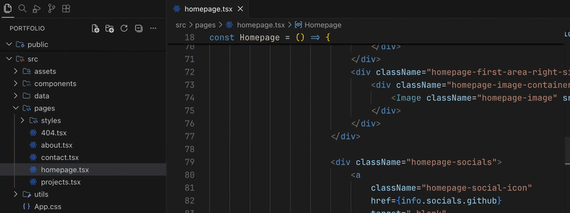

<h1>
  
  Advanced New File +
</h1>

Forked from VSCode's [Advanced New File](https://github.com/patbenatar/vscode-advanced-new-file)
extension, this updated version adds the ability to create files anywhere in your workspace with keyboard.



## Fork Improvements & Optimizations

This fork introduces several enhancements and optimizations over the original extension:

- **Better handling of ignored paths**

  Thanks to [`node-ignore`](https://github.com/kaelzhang/node-ignore) the extension now faithfully follows gitignore semantics, including negation (`!`), which wasn't respected in the original version, making rules like this correctly handled:

  ```
  wp-content/*
  !wp-content/themes/
  ```

- **Modern UI and improved creation flow**

  Replaced the InputBox with QuickPick for a more streamlined experience. Files can now be created directly without
  selecting a base directory first. Non-existent base directories are also supported and will be created automatically.

- **Removed `lodash` dependency**

  Reduced bundle size from ~1.74 MB to under 300 KB, eliminating unnecessary library bloat. All sorting and utility functions now use native JavaScript.

- **Other minor touch-ups**

  Updated dependencies, simplified logic, and improved typings for safer and more maintainable code.

These changes make the extension lighter, faster, and more accurate when scanning workspace paths for file creation.

## Features

- Fuzzy-matching autocomplete to create new file relative to existing path (thanks to
  [JoeNg93](https://github.com/JoeNg93) for making it faster)
- Create new directories while creating a new file
- Create a directory instead of a file by suffixing the file path with `/` as
  in `somedirectory/` to create the directory (thanks to
  [maximilianschmitt](https://github.com/maximilianschmitt))
- Ignores gitignored and workspace `files.exclude` settings.
- Additional option of adding `advancedNewFile.exclude` settings to workspace
  settings just like native `files.exlude` except it explicitly effects
  AdvancedNewFile plugin only. (thanks to [Kaffiend](https://github.com/Kaffiend))
- Control the order of top convenient options ("last selection", "current file",
  etc) via config setting `advancedNewFile.convenienceOptions`
- Brace expansion - expand braces into multiple files. Entering `index.{html,css}` will create and open `index.html` and `index.css`. (thanks to [chuckhendo](https://github.com/chuckhendo) and [timlogemann](https://github.com/timlogemann))

## Configuration Example

```
"advancedNewFile.exclude": {
  "node_modules": true,
  "node_modules_electron": true,
  "dev": true,
  "dist": true
},
"advancedNewFile.showInformationMessages": true,
"advancedNewFile.convenienceOptions": ["last", "current", "root"],
"advancedNewFile.expandBraces": false
```

## Usage

- Command palette: "Advanced New File"
- Keyboard shortcut: `⌘` `⌥` `N` (Mac), `Ctrl` `Alt` `N` (Win, Linux)

## Keybindings

You can add your own keybinding in your `keybindings.json`

```
{
  "key": "ctrl+n", // "cmd+n" on mac
  "command": "extension.advancedNewFile",
}
```

## Contributing

1. Clone the repo
1. `npm install`
1. Add your feature or fix (in `src/`) with test coverage (in `test/`)
1. Launch the extension and do some manual QA (via Debug > Launch Extension)
1. `npm test`
1. Run the linter: `npm run lint`
1. Open a PR
